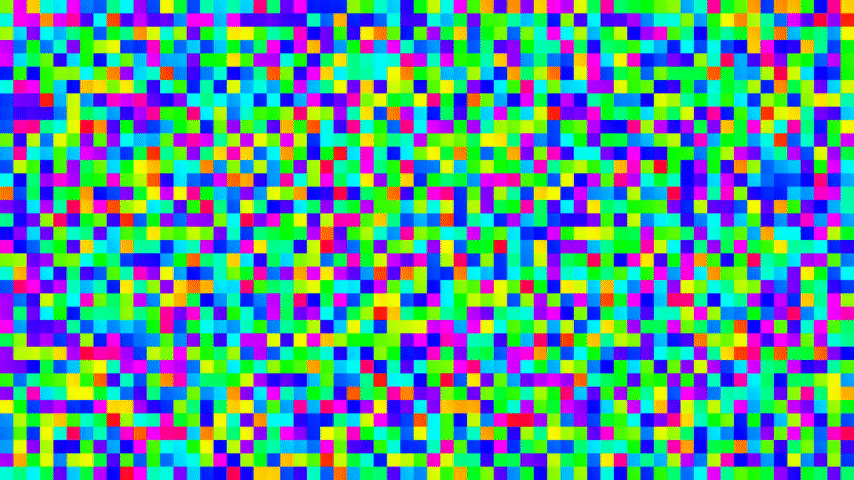

# Image Sorting Visualizer

Visualizes different sorting algorithms by treating an image as a list of square partitions, shuffling them, and then sorting them back into place. Every sampled step of the sort is rendered as a frame and compiled into a video.



`test.jpg` (1280x720) being sorted via comb sort with a partition size of 20px.

## Requirements

- Python 3.9+
- [ffmpeg](https://ffmpeg.org/) available on your `PATH`
- Python packages in `requirements.txt`:

```
pip install -r requirements.txt
```

## Usage

```
python main.py [options]
```

| Option | Default | Description |
|---|---|---|
| `-i`, `--image` | `test.jpg` | Path to the input image |
| `-a`, `--algorithm` | `insertion` | Sorting algorithm to visualize (see below) |
| `-s`, `--segment-size` | `10` | Size in pixels of each square partition |
| `-l`, `--length` | `5.0` | Length of the output video in seconds |
| `-f`, `--fps` | `30` | Framerate of the output video |
| `-o`, `--output` | `<algorithm>.mp4` | Path to the output video |

Example:

```
python main.py -i photo.jpg -a quick -s 20 -l 8 -f 15 -o quicksort.mp4
```
or
```
python main.py --image photo.jpg --algorithm quick --segment-size 20 --length 8 --fps 15 --output quicksort.mp4
```

Rendered frames are written to `output/` (cleared at the start of every run) and the compiled video is written to the project root.

## Algorithms

- `bubble`
- `insertion`
- `selection`
- `quick`
- `merge`
- `heap`
- `shaker` (bidirectional bubble sort)
- `comb` (bubble sort with a shrinking gap)
- `pancake` (sorts via prefix reversals)
- `radix` (non-comparison, digit-bucketed)
